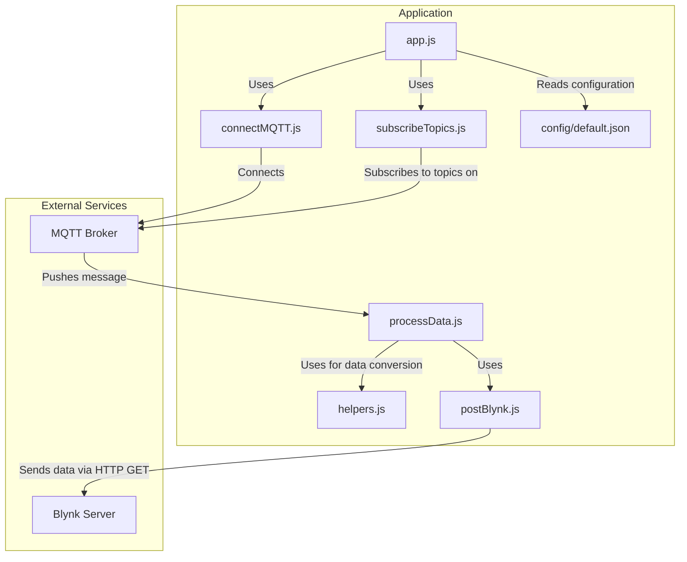

# mqtt-to-blynk-weather

[Change Log](./CHANGELOG.md)

Gets specified topic data (from config) and posts to Blynk Weather app

## Flow Diagram

```mermaid
graph TD
    subgraph Application
        A[app.js]
        B[connectMQTT.js]
        C[subscribeTopics.js]
        D[processData.js]
        E[helpers.js]
        F[postBlynk.js]
        G[config/default.json]
    end

    subgraph External Services
        H[MQTT Broker]
        I[Blynk Server]
    end

    A -- Reads configuration --> G;
    A -- Uses --> B;
    B -- Connects --> H;
    A -- Uses --> C;
    C -- Subscribes to topics on --> H;
    H -- Pushes message --> D;
    D -- Uses for data conversion --> E;
    D -- Uses --> F;
    F -- Sends data via HTTP GET --> I;
```
